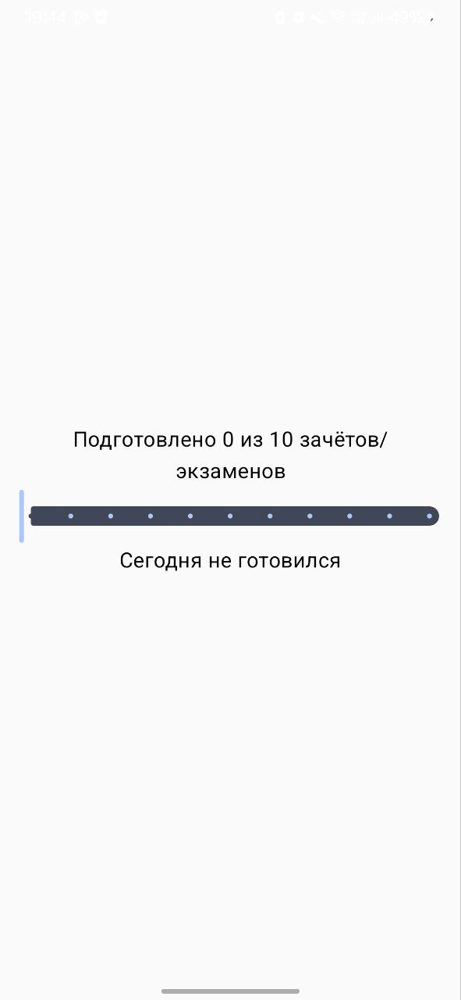
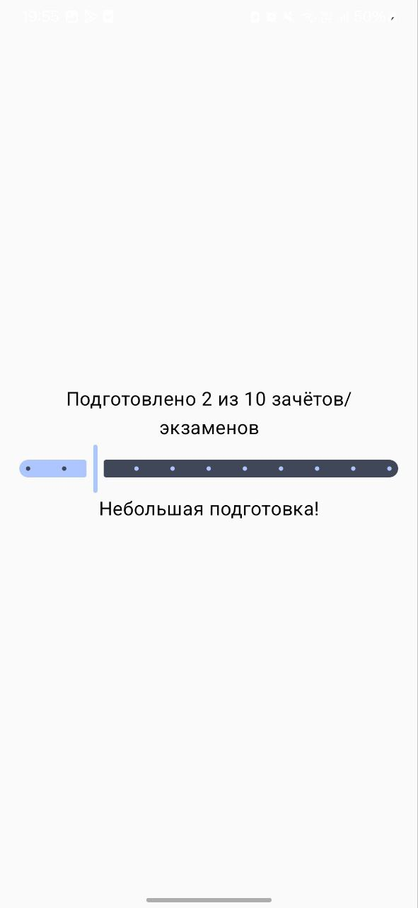
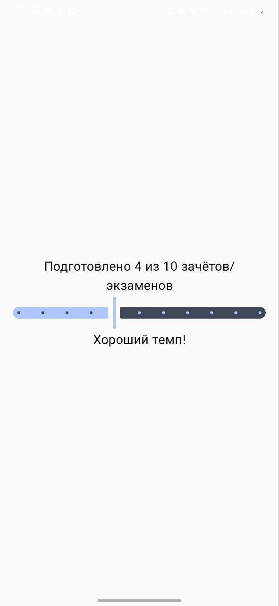
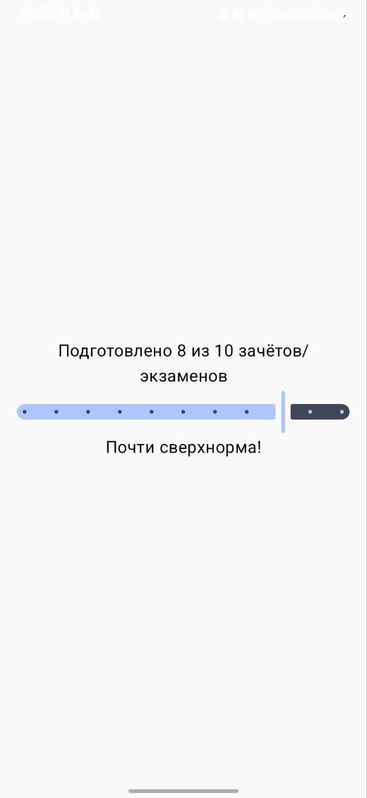
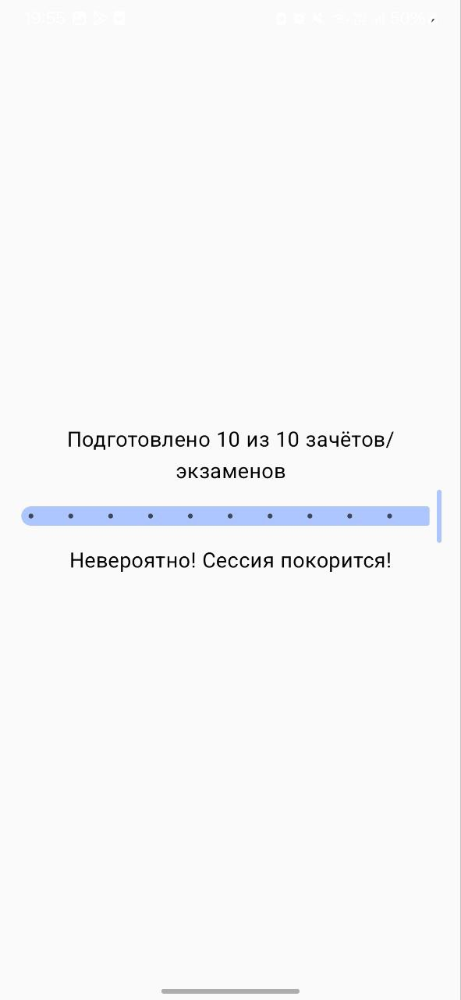
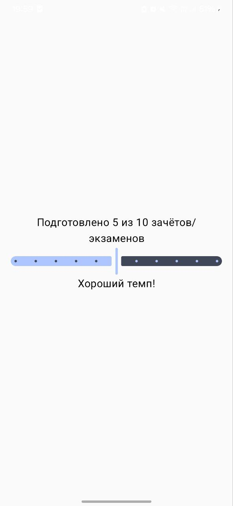
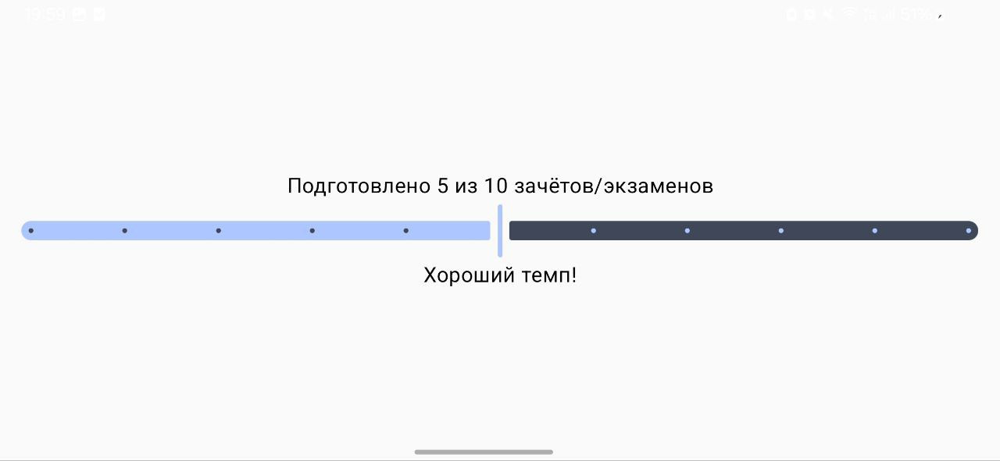

# Статус сессии

### Описание приложения
Статус сессии — это мобильное приложение для Android которое помогает студентам отслеживать ежедневный прогресс в подготовке к зачётам и экзаменам во время сессии. Приложение позволяет визуализировать достижения и мотивирует на регулярную подготовку.

### Функционал приложения
Основные возможности:
  * Интерактивный трекинг прогресса
  * Ползунок (Slider) для выбора количества подготовленных зачётов/экзаменов за день
  * Диапазон значений: от 0 до 10
  * Система статусов
  * Автоматическое определение уровня прогресса
  * Мотивирующие сообщения в зависимости от результата:
  * 
|Диапазон|Статус|Описание|
|0|"Сегодня не готовился"|Пользователь ещё не приступал к подготовке|
|1-3|"Небольшая подготовка!"|Начальный этап, разогрев|
|4-7|"Хороший темп!"|Стабильная продуктивная работа|
|8-9|"Почти сверхнорма!"|Высокая эффективность|
|10|"Невероятно! Сессия покорится!"|Максимальный результат дня|

  * Сохранение состояния
  * Прогресс сохраняется при повороте экрана
  * Используется rememberSaveable для сохранения состояния

### Скриншоты

